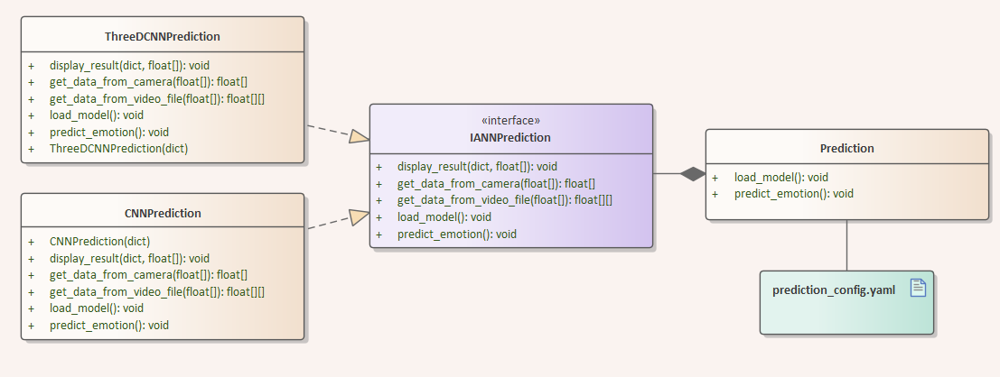
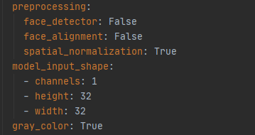
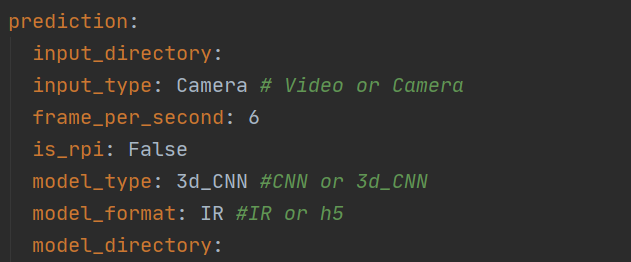
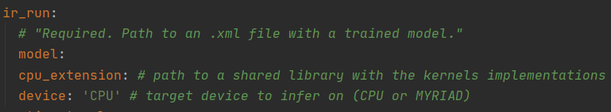
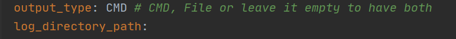
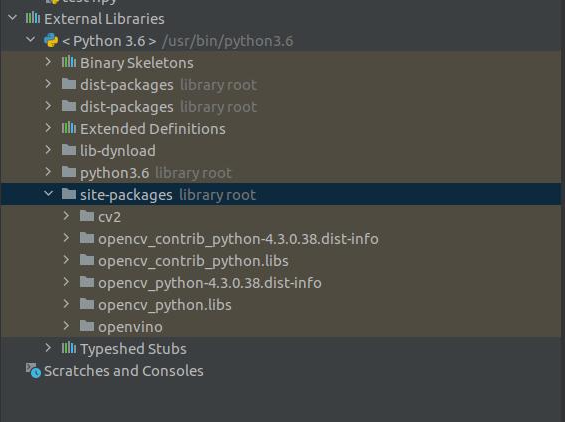
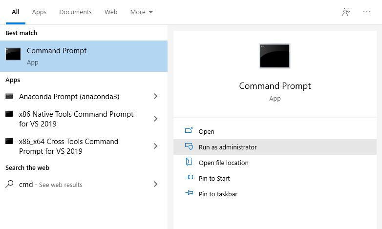

# Inference Module 
The inference module is a submodule of the STERN video subsystem that orchestrates data preparation, model loading, 
emotion classification, and classification output processing. 

The data preparation section is the first step that is used to prepare a video file from a directory or camera stream,
and extract important features for prediction. The next step is to load a previously trained model 
(a supported ANN architecture). The last step of this inference module is to display the results of inference. 
This step is used to log and show the histogram from output of trained model on the target device such as PC or Raspberry Pi. 
The following image (class diagram) shows the overall view of the inference module components.

 

The procedures and steps on how to run inference module are explained in detail as follows. These steps include  **data preparation**, **loading model** 
and **representing the results**.
 
### 1. Data preparation
This part is used to prepare the data for inference. The data preprocessing process varies based on 
model type, input type and environment. If model type be `threedCNN` we have to do preparation on batch of frames and
provide that batch to model. On the other hand, when the model type is `CNN` the input to model must be one pre-processed frame at a time. 
In case the input type is video or camera stream we should prepare frames differently for inference.
#### Configuration:
 
 * Uses a configuration file `src/inference/configuration.yml`
 * Executes the preprocessing modules (face_detector, face_alignment, spatial_normalization) according 
   to their order and values in the config file
	* Set the values of these modules  to `True` or `False`
	* These preprocessing modules should be applied in the same way they have been applied in training module 
 * `model_input_shape` can be configured in the config file based on how they are configured during training.
 * `gray_color` is configured in the config file and based on if training was with gray images or not it helps the preprocess process.
 
 

### 2. Loading model
This section is to load pre-trained (3d) cnn type neural networks to predict emotion. We have two types of models 
that we can use for inference(normal and optimized). The normal models are suitable for a desktop environments and 
optimized models can be run on any desktop environment (PC and laptop) as well as devices with restricted resources 
such as Raspberry pi in our case.   
#### Configuration:
 * Uses a configuration file `src/inference/configuration.yml`
 * Loads  different formats of pre-trained model using `model_format`.
    * Loads the normal trained model in `.h5` format from `model_directory`.
    * Loads the optimized trained model in `.xml` and `.bin` format from `ir_run` `model`.
 * Loads  different architectures of pre-trained model using `model_type`.  

### 3. Displaying the results
In this section, the prediction results will be printed to console or a file and in case the input type 
is a camera stream, the result will also be shown as a histogram on camera frames.  
#### Configuration:
 * Uses a configuration file `src/inference/configuration.yml`
 * `output_type` identifies how we are going to log the results of model. We have two options for this configurable, `CMD`
 to print the results in console or `FILE` to print in a log file.  
 * `log_directory_path` shows the directory in which the log file exist.  

## Setup the environment
Setting up the environment is explained in Section 2 of the Software Transfer Document.

* Copy `openvino` folder from the same python version API that you use in IDE or virtual environment to 
the `site-packages` directory used by python.

 * Video module requires three additional files for face alignment and spatial normalization. These files are 
 `face-detection-adas-0001.xml`, `face-detection-adas-0001.bin` and `shape_predictor_68_face_landmarks.dat`.
 Make sure they exist in `models/` folder and do not rename them. 
 

#### Dependency installation
 * Install python dependencies in `requirements.txt`: run `pip install -r requirements.txt`

#### Usage
##### Windows 10
In windows 10, in order to run `openvino` library, we need to activate its environment variables 
and the script execution within the same administrator command prompt window. There are six steps to execute 
the inference module in Windows 10, which are
1. Click windows icon and write `cmd` 
2. Click on `Run as administrator`.
 
3. Change directory to `openvino/bin` and run `setupvars.bat`
4. Change directory to your project directory via the same command prompt window
5. Set the required parameters in the configuration file in `src/inference/configuration.yml` 
6. Go to the `src/inference` directory and run `prediction.py`

##### Raspberry Pi or Linux
In Raspberry Pi or Linux, we can set the environment variable of OpenVINO permanently, as it is already explained in 
section 2.2.2.2 of Software Transfer Document, specifically in step 3. Therefore, it takes only four steps to execute 
the inference module in Raspberry Pi or Linux, as follows
1. Open terminal
2. Change directory to your project directory
3. Set the required parameters in the configuration file in `src/inference/configuration.yml`
4. Go to the `src/inference` directory and run `prediction.py`