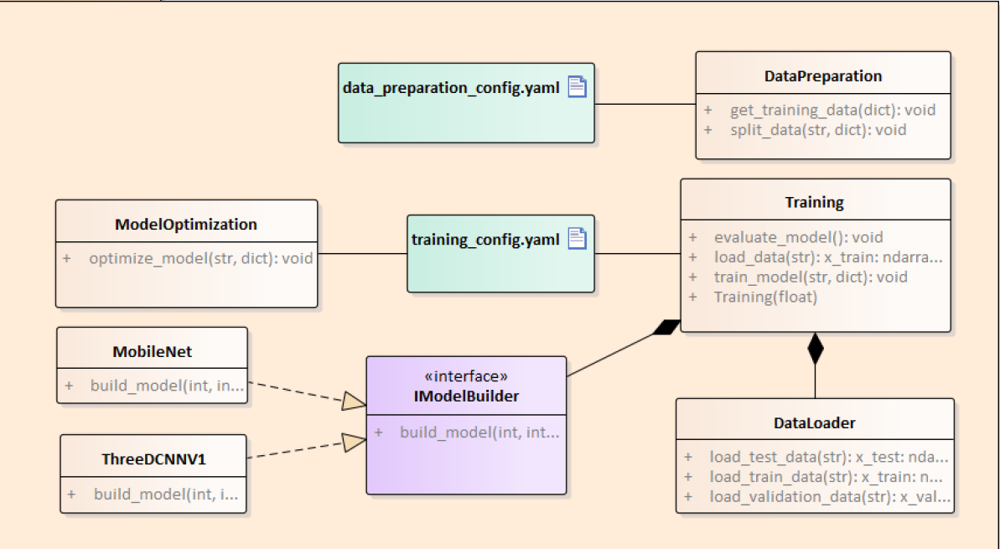
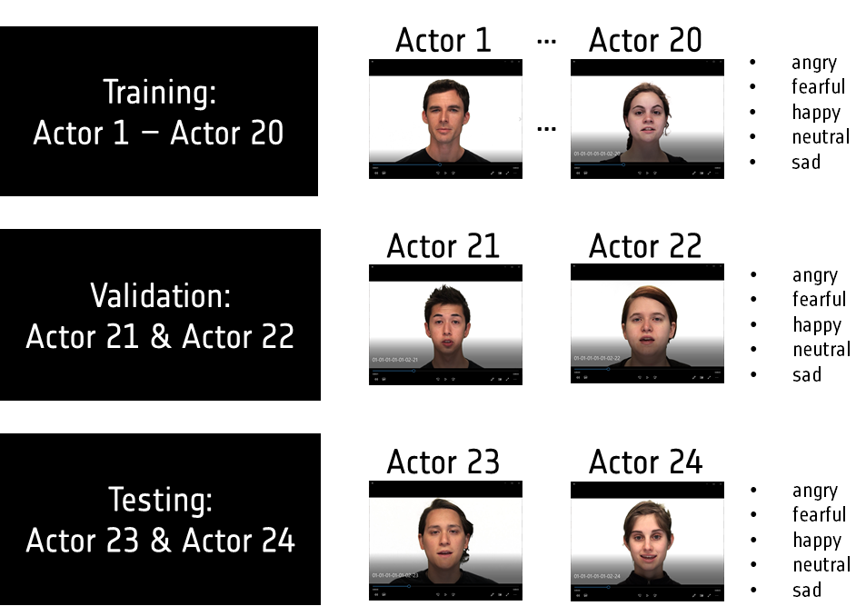
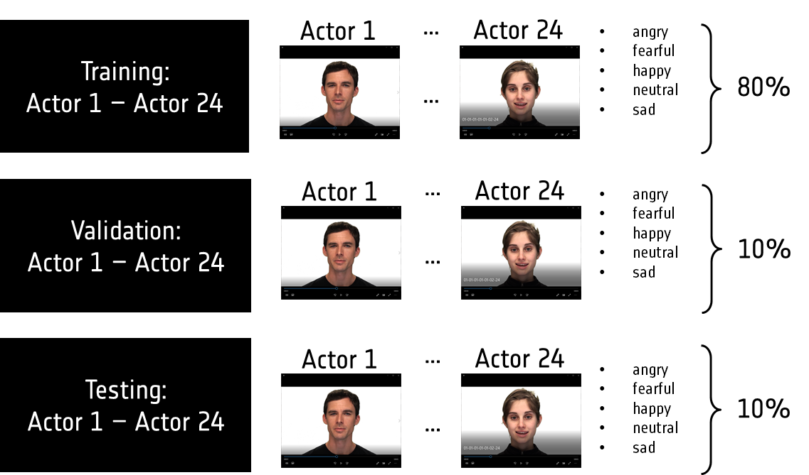

# Training Module 
This training module is a submodule of the STERN software that is responsible for data preparation, model training, and
model optimization. The data preparation is the first step that is used to read a training dataset from
a directory, extract important features, and split the dataset into training, validation and testing. The next step is training. It is responsible to train a given supported ANN architecture and save it into a specified directory.
The last step of this training module is post-training model optimization. This step is used to optimize the size of a trained model
so that the model can run on an edge target device such as Raspberry Pi. The following image (class diagram) shows the overall view of
the training module components.

 

The procedures and steps on how to use and run the three main components (data preparation, training, optimization) of the training module are 
explained in detail as follows.  
## 1. Data Preparation 
This data preparation script (*data_preparation.py*) helps to preprocess the raw training dataset that will be used to 
train an instance of our video sentiment analyzer models. In order to run this data preparation script, the dataset directory structure 
and the configuration file should be structured and configured properly as described below.
### Dataset Structure
In our STERN application, we used RAVDESS and CREMA-d datasets to train, validate and test our models. For our application, the dataset 
should be organized as the following directory structure.
```
    ../dataset
     |___training
     |   | filename.mp4
     |   | filename.mp4
     |   | ...
     |___validation
     |   | filename.mp4
     |   | filename.mp4
     |   | ...
     |___testing
     |   | filename.mp4
     |   | filename.mp4
     |   | ...
   ```  
If there is a need to use another dataset or combine with RAVDESS, the filename of the new dataset videos should be in  
RAVDESS filename naming convention  format. In RAVDESS, The filename consists of a seven-part numerical identifier.
An example of RAVDESS filename encoding format is described below.<br/>
Filename identifiers:
 * **Modality** (01 = full-AV, 02 = video-only, 03 = audio-only).
 * **Vocal channel** (01 = speech, 02 = song).
 * **Emotion** (01 = neutral, 02 = calm, 03 = happy, 04 = sad, 05 = angry, 06 = fearful, 07 = disgust, 08 = surprised).
 * **Emotional** intensity (01 = normal, 02 = strong). NOTE: There is no strong intensity for the 'neutral' emotion.
 * **Statement** (01 = "Kids are talking by the door", 02 = "Dogs are sitting by the door").
 * **Repetition** (01 = 1st repetition, 02 = 2nd repetition).
 * **Actor** (01 to 24. Odd numbered actors are male, even numbered actors are female).<br>

**example filename**: `02-01-01-01-01-02-03.mp4`
 
For more information about RAVDESS dataset filename naming convention and structure, please read this [link](https://zenodo.org/record/1188976#.X84wa9hKiUk) 
### Configuration
The configuration file for the data preparation script has the following configurable parameters:
 * ***dataset_type*:** Used to decide how to split the training dataset. It has two possible values: `actor` or `percentage` . 
 These two type of data split are shown in the following image.
 
 | Actor based   | Percentage based |
 | ------------- | ------------- |
 |   |   |
 * ***face_detector*:** Boolean value to enable or disable this preprocessing step. 
 * ***face_alignment*:** Boolean value to enable or disable this preprocessing step.
 * ***spatial_normalization*:** Boolean value to enable or disable this preprocessing step.
 * ***data_input_pat*h:**  An absolute or relative path to the dataset directory.
 * ***data_output_path*:** An absolute or relative path to a directory where the processed dataset will be saved.
 * ***frame_per_second*:** Value to determine the number of frames per second.
 * ***depth*:** Value used to specify how many sequences of frames will be generated from a given video clip.
 * ***num_classes*:** Number of emotion types that should be classified by the trained model.
 * ***image_size*:** The size of an image that will be used to train a model
 * ***gray_color*:** Boolean value used to decide if converting the given input to grayscale is needed. If it is set to True, the input image will be converted to grayscale.
 * ***channel*:** The channel of an image. Its values is either 1 or 3.
 * ***emotion*:** This is used to enable or disable emotion types <br/>
 
An example of the data preparation configuration file structure and sample parameter values  is shown below.
```
dataset_type: actor 
data_parameters: 
  preprocessing:
    face_detector: False
    face_alignment: False
    spatial_normalization: True
  data_input_path: "" #  folder path for raw dataset
  data_output_path: ../../data/processed 
  frame_per_second: 6 
  depth: 12 
  num_classes: 5
  image_size: 32
  gray_color: True
  channel: 1
  emotion:
    "01": True # neutral
    "02": False # calm
    "03": True # happy
    "04": True # sad
    "05": True # angry
    "06": True # fearful
    "07": False # disgusted
    "08": False # surprised
```

**Note:** At the same time either face_detector and face_alignment or spatial_normalization should be enabled. This means that if face_detector and face_alignment are enabled,
spatial_normalization should be disabled and vice versa. <br/>
### Usage
Once the dataset structure and the parameters mentioned above in the file `src/training/config/data_preparation_config.yaml` are configured, run the command
below to execute the data preparation script.
```
    python src/training/data_preparation.py
```
After the data preparation finishes, the preprocessed training, validation, and testing will be created.
* training_data.npz
* validation_data.npz
* testing_data.npz <br/>

These data files will be loaded during training by the data loader script that will be  triggered by the training script.
## 2. Model Training 
This training script is used to build, train, and evaluate a (3d) cnn network types. The configuration file
`src/training/config/training_config.yaml` is used to configure training parameters. The training script also uses an instance of a 
data loader class to load the preprocessed training, validation, and testing  dataset extracted by the data preparation script.
### Configuration
For running this training script, the training parameters should be configured first. These parameters 
are explained as follows.
 * ***model_type*:** Used to identify which instance of ANN we have to train. cnn and 3d_cnn are the possible values for our STERN application.
 * ***data_input_path*:** An absolute or relative  path directory for the raw training dataset.
 * ***model_builder*:** A type of CNN that that we would like to train. Possible values are MobileNet and ThreeDCNNV1.
 * ***model_output_path*:** An absolute or relative path directory to save the trained model
 * ***trained_model_name*:** A filename for the trained model.
 * ***epochs*:** The number of epochs for training.
 * ***batch_size*:** Defines the number of training dataset samples that will be used per iteration.
 * ***learning_rate*:** Value used for setting the learning rate for the training model optimizer.
 * ***num_classes*:** Number of emotion types that should be classified by the trained model.
 * ***n_conv_filters*:** List of filters that will be used in different convolution layers of the ANN models. 
 * ***kernel_size*:** : A two-dimensional or three-dimensional value depending on the type of the ANN. It used in the Convolution layers of the model.
 * ***model_input_shape*:** Input shape of the ANN model. It is the width, height, and channel of the input image.
 * ***gray_color*:** Boolean value used to decide if converting the given input to grayscale is needed. If it is set to True, the input image will be converted to grayscale.
 * ***depth*:** Value used to specify how many sequences of frames will be generated from a given video clip.
 * ***frames_per_second*:** Value to determine the number of frames per second. <br/>
 
An example of the training configuration file structure and sample parameter values is shown below.
```
model_type : 3d_cnn  
train_params:
  data_input_path: ../../data/processed
  model_builder: ThreeDCNNV1 
  model_output_path: ../../models 
  trained_model_name: 3d_cnn_candidate_model  
  epochs: 1
  batch_size: 128
  learning_rate: 0.001
  num_classes: 5
  n_conv_filters: [32, 64]
  kernel_size: [3, 3, 3]
  model_input_shape: [32, 32, 1]
  gray_color: True
  depth : 12
  frames_per_second : 12

```
### Usage
After `src/training/config/training_config.yaml` is configured according to the above definitions, run the command below to execute the training script.
```
    python src/training/training.py
```
After the training script finishes, The trained model is saved in  `.pb` format into a directory configured in the configuration file. Additionally, the script
saves the model training parameters in `src/training/training_log` directory for later reference.
## 3. Model Optimization
This is a post-training model optimization step to optimize a trained model using openvino API.
A configuration file `src/training/config/training_config.yaml` is used to configure optimization parameters. This optimization script 
loads  a trained model to optimize that was saved in `.pb` format. Before executing the model optimization script, we should install 
OpenVINO version 2020.4 or higher in our machine. The *Software Transfer document* or this [link](https://docs.openvinotoolkit.org/2020.4/openvino_docs_install_guides_installing_openvino_windows.html ) can be used 
to follow the steps for installing OpenVINO version 2020.4 or higher.
### Configuration
The following parameters should be configured in the `src/training/config/training_config.yaml` before running our optimization script.
 * ***depth*:** Value to determine the number of frames per second.
 * ***model_input_shape*:** The input shape of the trained model to be optimized.  
 * ***trained_model_name*:** The filename of the trained model to be optimized. 
 * ***model_input_path*:** An absolute path to a folder where the trained model is saved.
 * ***optimized_output_path*:** An absolute path to a folder where the optimized model will be saved.
 * ***openvino_inst_dir*:** An absolute path to the bin folder of OpenVINO installation.
 * ***openvino_optimizer_dir*:** An absolute path to the model optimizer folder of OpenVINO installation. 

An example of the model optimization configuration structure and sample parameter values is shown below. 
```
optimization_params:
  depth : 12
  model_input_shape: [32, 32, 1]
  trained_model_name: 3d_cnn_candidate_model 
  model_input_path: "" # absolute folder path to a trained model
  optimized_output_path: "" # absolute folder path to save the optimized model
  openvino_inst_dir: "" # absolute path to bin folder  of openvino installation
  openvino_optimizer_dir: "" # absolute path to model_optimizer folder  of openvino installation

```
### Usage
Once OpenVINO is installed properly and the parameters mentioned above for the model optimization in `src/training/config/training_config.yaml` are configured, run the 
command below to execute the model optimization script.
```
    python src/training/model_optimization.py
```
After execution of the script is complete, It generates the optimized model in `.xml` and `.bin` format into a directory as shown in the following image. <br>

 
 
The optimized model can be easily loaded by our *inference module* of video STERN application to run it both on PC or Raspberry Pi.
