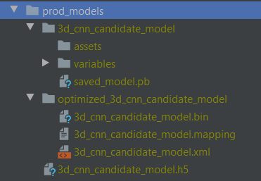
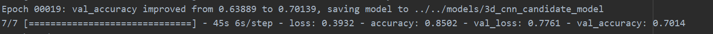
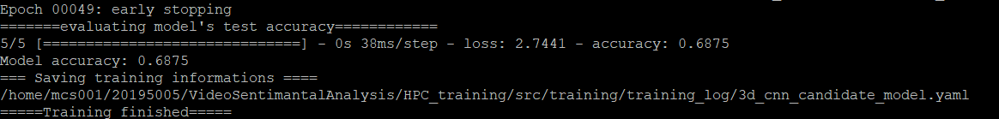

## Training 3d_cnn model 
#### Model info:
 * Trained using RAVDESS dataset splited based on actor as follows and for five emotion types: 
  `neutral`, `happy`, `sad`, `angry`, `fearful`
    * Training dataset: actor 1 - actor 20
    * Validation dataset: actor 21 and actor 22
    * Testing dataset: actor 23 and actor 24
 * Trained with early stopping and with the following training parameters  
 
 * The model is save in `tensorflow`, `keras`, and `IR` format. 
 
#### Model performance 
 * Validation accuracy: `70.14`
 
 * Testing accuracy : `68.75`
 
#### Model location
* The model is stored in a remote server (Amazon)
* It is stored in the `prod_models` directory with name:
  * `3d_cnn_candidate_model` for tensorflow format
  * `optimized_3d_cnn_candidate_model` for IR format
  * `3d_cnn_candidate_model.h5` for keras format
#### How to access the trained model 
 * Clone/pull this  branch
 * Run `dvc pull`
 * The model will be  downloaded into `prod_models` directory.
 