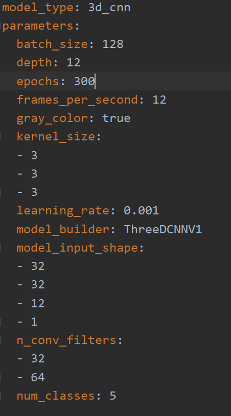
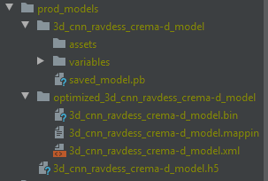
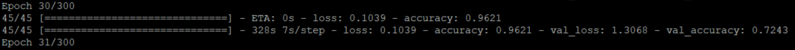
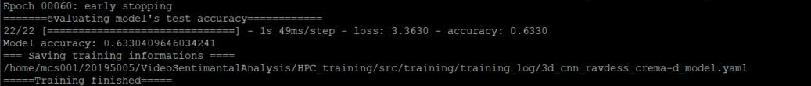

## Training 3d_cnn model with RAVDESS and CREMA-d datasets
#### Model info:
 * Trained  based on actor dataset split for five emotion types: 
  `neutral`, `happy`, `sad`, `angry`, `fearful`
    * Training dataset: RAVDESS: actor 1 - actor 20, CREMA-d: actor 25 - actor 97
    * Validation dataset: RAVDESS: actor 21 and actor 22, CREMA-d: actor 98 - 102 and 104, 105, 107, 109 
    * Testing dataset: actor 23 and actor 24, CREMA-d: actor 103, 106, 108, and actor 110 - actor 115
 * Trained with early stopping and with the following training parameters  
 
 * The model is save in `tensorflow`, `keras`, and `IR` format. 
 
#### Model performance 
 * Validation accuracy: `72.43`
 
 * Testing accuracy : `63.30`
 
#### Model location
* The model is stored in a remote server (Amazon)
* It is stored in the `prod_models` directory with name:
  * `3d_cnn_ravdess_crema-d_model` for tensorflow format
  * `optimized_3d_cnn_ravdess_crema-d_model` for IR format
  * `3d_cnn_ravdess_crema-d_model.h5` for keras format
#### How to access the trained model 
 * Clone/pull this  branch
 * Run `dvc pull`
 * The model will be  downloaded into `prod_models` directory.
 